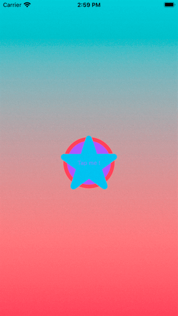

# iTunesExplorer


**An iOS learning support mini-app**  
&emsp; Based on the StoreSearch tutorial from the *[UIKit Apprentice](https://www.kodeco.com/books/uikit-apprentice/v10.0), by Fahim Farook*.  
&emsp; My aim is to rewrite the UI using **SwiftUI** instead of **UIKit** and customize it to improve my knowledge.  
&emsp; Using, for example, **swift packages**  or practicing **swift concurrency** with the **Combine framework** 

<br/>

**Highlighted parts** 

* [**Fetching API using `URLSessionDataTask`**](#fetching-api-using-urlsessiondatatask)
* [**Fetching API using `Combine`**](#fetching-api-using-combine)
* [**Unit Testing in asynchronous context**](#unit-testing-in-asynchronous-context)
* [**Swift Packages**](#swift-packages)

---

<br/>

<table style="border: 0px;">
    <tr>
        <td >
            
        </td>
        <td>
            <div style="margin-left: 20px; width:260px;">
                <h2><b>Start it easy</b></h2>
                <p> I chose to added this star-shapped button, gently animated as a welcoming screen.</p>
            </div>
        </td>
    </tr>
</table>

<br/>

## **Fetching API using `URLSessionDataTask`**

The **core** of this app excerpt is to **fetch JSON** from iTunes **API**.  
The initial version of iTunesExplorer is using the framework **`URLSession`** to manage the fetching asynchronously with an `URLSessionDataTask`

```swift
    dataTask?.cancel() // manually manage cancel fetching

    dataTask = URLSession.shared.dataTask(with: url) { data, response, error in
    // receiving on [secondary thread]
    // validating HTTPURLResponse
    // parsing JSON
    // handle the errors
        
    // switch to [main thread] to update
    DispatchQueue.main.async {
        // call completion closure
        // update states
        }
    }
    dataTask?.resume() // activate the URLSessionDataTask after configuration step
```
*you can see entire code [here](/iTunesExplorer/Models/Explo.swift) inside* performExplo(for:category:completion:) *method*

## **Fetching API using `Combine`**

Here the expected thing will be to use the **`combine`** framework to manage the fetching.  

```swift 
    URLSession.shared
        .dataTaskPublisher(for: url)         // create publisher
        .receive(on: DispatchQueue.main)     // receive on main thread
        .tryMap { }                          // validating HTTPURLResponse
        .decode([...])                       // parsing JSON
        .mapError { error -> Error in }      // use an enum to identify errors
        .sink { }                            // handle the fetched item or errors with completion closure
        .store(in: [...])                    // automatically manage cancel fetching
```
*you can see entire code [here](/iTunesExplorer/Models/ExploUsingCombine.swift) inside* performExplo(for:category:callBack:) *method*

<br/>

<table style="border: 0px;">
    <tr>
        <td >
            
        </td>
        <td>
            <div style="margin-left: 20px; width:260px;">
                <h2><b>Let's explore</b></h2>
                <p> Here's a fetching demo. The search can be filtered by category thanks to the segmented control.</p>
            </div>
        </td>
    </tr>
</table>

<br/>

## **Unit Testing in asynchronous context**

A quick **XCTest** unit test to valid the fetching rework using **Combine** instead of **URLSessionDataTask**.  
As I not directly used `await` in code, i had to test the asynchronous method using `XCTestExpectation()`

```swift
import XCTest
@testable import iTunesExplorer

final class performExploTest: XCTestCase {

    func testComparingFetches() throws {
        let expectation_URLSession = XCTestExpectation()
        let expectation_Combine = XCTestExpectation()
        // [...]
        expectation_URLSession.fulfill()
        // [...]

        wait(for: [expectation_URLSession, expectation_Combine], timeout: 6.0)

        addTeardownBlock {
            XCTAssertEqual(resultWithURLSession, resultWithCombine, "The two fetches don't give the same")
        }
    }
}
```

<br/>

<table style="border: 0px;">
    <tr>
        <td >
            <div style="margin-left: 20px; width:260px;">
                <h2><b>Color schemes</b></h2>
                <p> Create <b>ColorSet</b> in Xcode Assets make the switching between color mode easy.</p>
            </div>
        </td>
        <td>
            
        </td>
    </tr>
</table>

<br/>

## **Swift Packages**

I created a personnal Library named **Neopuyo** as a **Swift Package** and integrated it in the project.  
The content of the library isn't really meaningfull here, the purpose was more about training.  

And before all, i could write this, just below Apple modules : 

```swift
import SwiftUI
import Neopuyo // so cool isn't it ?
```